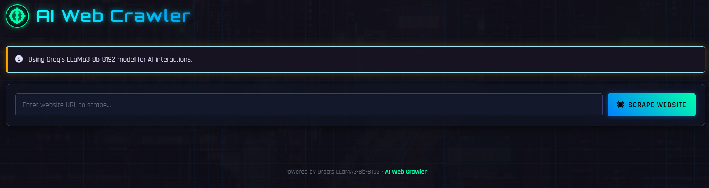
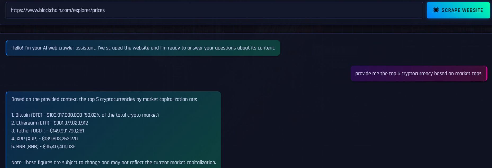

AI-Enhanced Web Crawler


## Overview
AI-Enhanced Web Crawler is a modern  web application that allows users to scrape any public website and interact with its content using Groq's LLaMA3-8b-8192 large language model. The app combines advanced web scraping, vector search, and conversational AI to deliver instant, context-aware answers about any website you provide.

---

## Features
- **Website Scraping:** Enter any URL to extract and index its content automatically.
- **Conversational AI:** Ask questions about the scraped website and get intelligent, context-aware answers powered by Groq's LLaMA3-8b-8192.
- **Session Management:** Unique session IDs for each website/chat, ensuring privacy and data isolation.
- **No Client API Key Needed:** API keys are securely managed server-side.

---

## Screenshots
 **Interface**

**Working**


---

## Getting Started

### Prerequisites
- Python 3.9+
- Node.js (for advanced frontend development, optional)

### Installation
1. **Clone the repository:**
   ```bash
   git clone https://github.com/prasanth-42/AI-Enhanced-Web-Crawler.git
   cd AI-Enhanced-Web-Crawler
   ```
2. **Create and activate a virtual environment:**
   ```bash
   python -m venv venv
   # On Windows:
   venv\Scripts\activate
   # On Unix/Mac:
   source venv/bin/activate
   ```
3. **Install Python dependencies:**
   ```bash
   pip install -r requirements.txt
   ```
4. **Configure environment variables:**
   - Create `.env` and fill in your Groq API key and session secret.
   
5. **Run the application:**
   ```bash
   python main.py
   # Or run with Flask directly:
   # flask run
   ```
6. **Open your browser:**
   - Visit [http://localhost:5000](http://localhost:5000)

---

## Usage
1. Enter a website URL in the input field and click "Scrape Website".
2. Once scraping completes, the chat interface will appear.
3. Ask any question about the website's content in natural language.
4. Get instant, AI-powered answers!

---

## Technologies Used
- **Frontend:**
  - HTML5, CSS3 , Bootstrap 5
  - JavaScript
- **Backend:**
  - Python 3, Flask, Flask-CORS, Flask-SQLAlchemy
  - LangChain (community, core, and RAG)
  - ChromaDB (vector database)
  - BeautifulSoup4, Trafilatura (web scraping)
  - Groq API (LLaMA3-8b-8192)
- **Other:**
  - dotenv (for environment management)

---

## Project Structure
```
AI-Enhanced-Web-Crawler/
├── client/
│   ├── index.html
│   ├── css/
│   │   ├── cyberpunk.css
│   │   └── styles.css
│   └── js/
│       ├── app.js
│       └── chat.js
├── server/
│   ├── app.py
│   ├── scraper_service.py
│   ├── llm_service.py
│   └── utils.py
├── screenshots/
│   ├── interface.png
│   └── working.png
├── requirements.txt
├── main.py
├── .env
└── README.md
```

---

## Contributing
Pull requests are welcome! For major changes, please open an issue first to discuss what you would like to change.

---

## License
[MIT](LICENSE)

---

## Contact
For questions or support, please open an issue on GitHub
---

